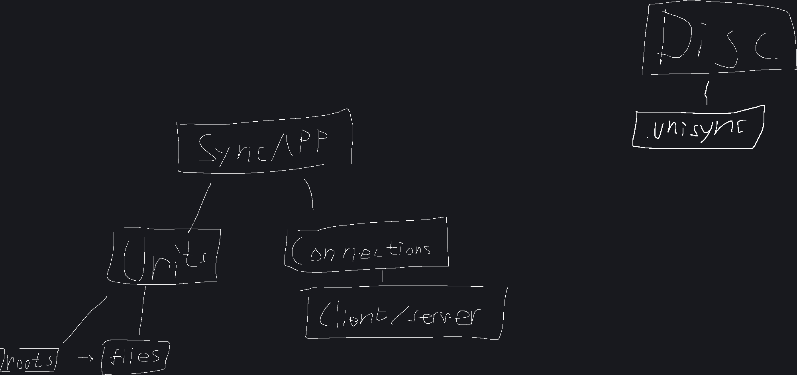

I am rewriting UniSync in BetterThanBatch because I am not happy with the C++ code and the design of the program.
Moving forward it will also be beneficial to code UniSync in a language I like more.

# UniSync
Program to synchronize files across computers. It has security flaws so don't actually use this for serious things.

Diagram of the app

## Building